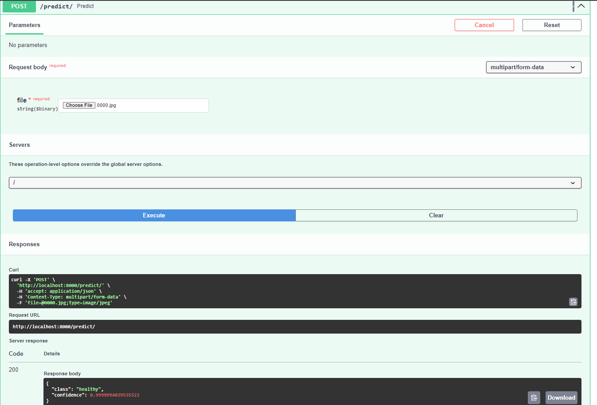
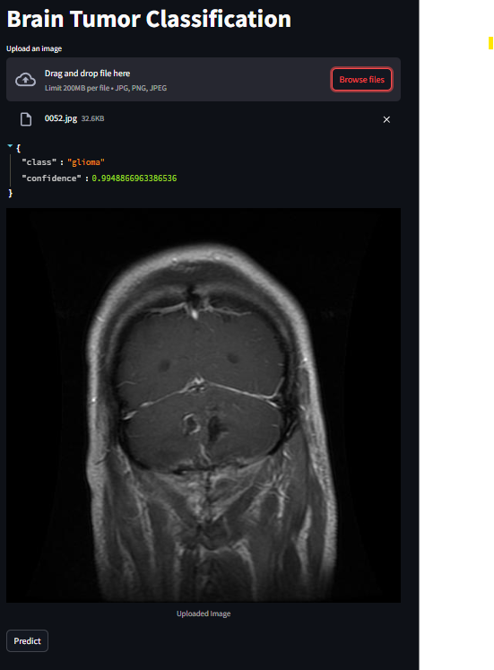
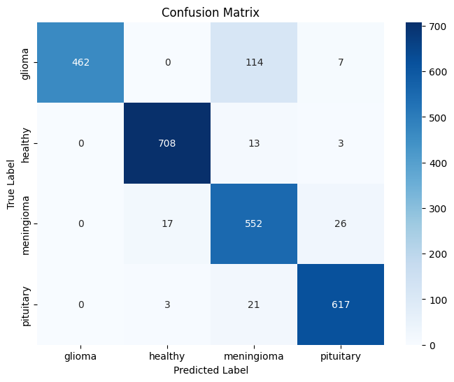

# Brain Tumor Classification Using ResNet50

This project focuses on classifying brain tumor types using MRI scans. The dataset contains images of 4 different classes: **glioma**, **healthy**, **meningioma**, and **pituitary** tumors. The model used for classification is **ResNet50**, implemented with TensorFlow, and the application has been deployed using **FastAPI** as the backend and **Streamlit** as the frontend.

## Dataset

The dataset used for this project is sourced from Kaggle:

[Brain Tumor MRI Scans Dataset](https://www.kaggle.com/datasets/rm1000/brain-tumor-mri-scans)

It contains MRI images for the following 4 classes:
- **Glioma**
- **Healthy**
- **Meningioma**
- **Pituitary**

## Project Structure

1. **Backend**: The backend is built using **FastAPI**, which serves the model for inference.
    - Below is an example of the FastAPI endpoint interface used for model predictions:
    
    

2. **Frontend**: The frontend is developed using **Streamlit**, providing a simple UI for users to upload MRI images and view predictions.
    - Below is a result of the Streamlit UI showcasing the model prediction:
    
    

3. **Model**: The model used is **ResNet50**, pre-trained on ImageNet and fine-tuned for our custom 4-class classification task.
    - Custom callbacks are implemented to save the best model during training based on validation performance.

## Custom Callbacks

To achieve the best model performance, custom callbacks were introduced, including:
- **ModelCheckpoint**: To save the model with the best validation accuracy.
- **EarlyStopping**: To stop training when the validation performance starts to degrade.
- **LearningRateScheduler**: To dynamically adjust the learning rate during training.

## Model Performance

After training the model on the Kaggle dataset, we tested it on the validation set and generated a confusion matrix to evaluate its performance. The confusion matrix demonstrates that the model is effective at predicting the 4 classes in the test set.

Here is the confusion matrix:

## Conclusion

This project demonstrates that the **ResNet50** model can successfully classify brain tumor types from MRI images. The deployment pipeline using **FastAPI** and **Streamlit** shows that the model is capable of real-time inference and can be used in a production environment.
